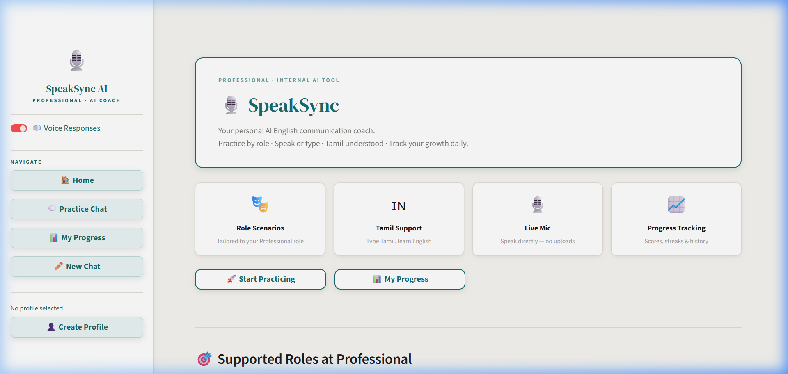
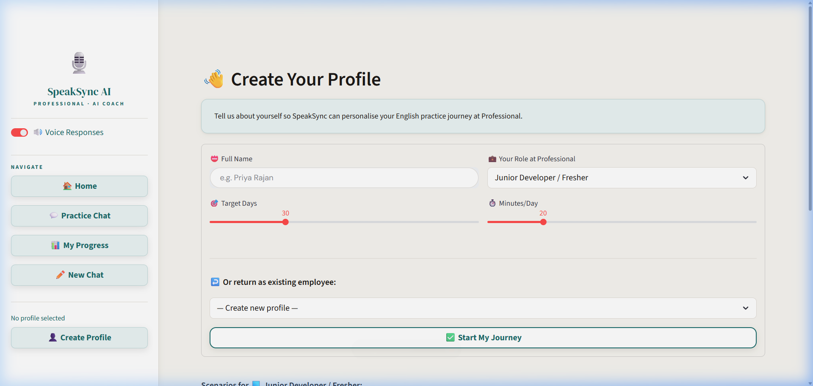
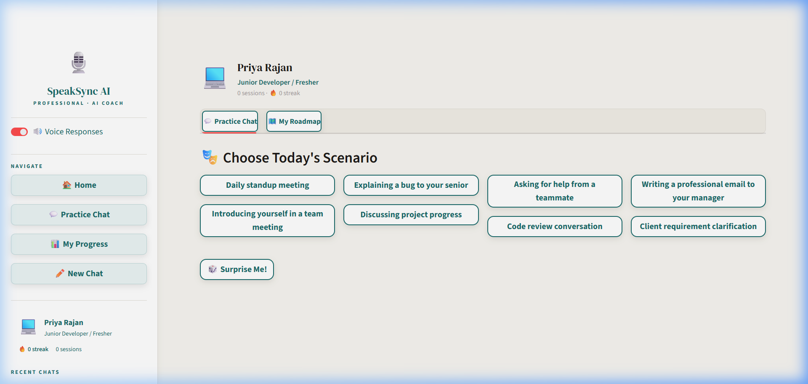

# 🎙️ SpeakSync AI - Professional Communication Coach

**SpeakSync AI** is a premium, AI-driven communication training platform designed for the VDart ecosystem. It empowers employees to master professional English communication, refine their tone, and build confidence through immersive roleplay scenarios.


---

## 🌟 Visual Tour

### 🏠 Modern Landing Page
A clean, professional entry point highlighting core capabilities and progress tracking.


### 👤 Personalized AI Profile
Tailor your experience by creating a profile linked to your specific professional role.


### 🎭 Realistic Practice Scenarios
Choose from a variety of workplace situations, from client meetings to internal briefings.


### 💬 Intelligent Coaching Interface
Practice by speaking or typing. Receive instant feedback and scores on your communication.


---

## 🚀 Key Features

- **🎭 AI Roleplay Scenarios**: Tailored scenarios for IT Support, HR, Project Management, and more.
- **🇮🇳 Tamil Support**: Type in Tamil/Tanglish and learn how to express those thoughts in professional English.
- **🎙️ Real-time Voice Input**: Seamlessly switch between typing and speaking for natural practice.
- **📈 Progress Tracking**: Visual dashboards for session scores, daily streaks, and personalized roadmaps.
- **🔊 Natural Voice Synthesis**: AI responses are read aloud to help with listening and pronunciation.

## 🛠️ Technology Stack

- **Frontend**: Streamlit with custom CSS (Glassmorphism & High-Contrast White Theme)
- **AI Engine**: Groq (Llama 3.3 70B & Whisper-Large-v3)
- **Database**: SQLite for persistent user profiles and chat history
- **Audio**: gTTS & Web Speech API

## 📋 Getting Started

### Prerequisites
- Python 3.9+
- A Groq API Key ([Get it here](https://console.groq.com/))

### Installation

1. **Clone the repository**:
   ```bash
   git clone https://github.com/muhammedshemeer/Communication_Coach_AI.git
   cd Communication_Coach_AI
   ```

2. **Install dependencies**:
   ```bash
   pip install -r requirements.txt
   ```

3. **Set up Secrets**:
   Create a `.env` file or set an environment variable:
   ```bash
   GROQ_API_KEY="your_groq_api_key_here"
   ```

### Running the App
```bash
streamlit run app.py
```

## 📂 Project Structure

- `app.py`: Main application controller and UI layout.
- `chatbot/`: AI integration, role-based prompting, and scoring logic.
- `database/`: Persistence layer for user data and session history.
- `assets/`: Custom styling and project screenshots.

---

Developed for the **VDart Intern Project**.
Created by **Mohammed Shameer**.
